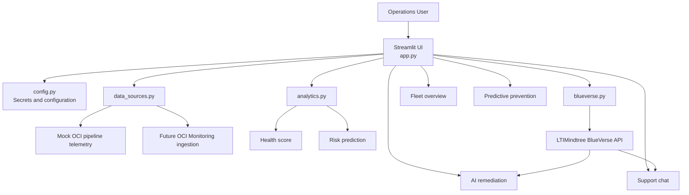

# Architecture Diagram

## Overview
The solution is centered on a Streamlit application that orchestrates telemetry loading, scoring, dashboard rendering, and AI-assisted operator workflows.

## Component Responsibilities
- `app.py` manages page structure, user interactions, and prompt assembly.
- `config.py` loads BlueVerse secrets safely so the dashboard can still render when AI configuration is missing.
- `data_sources.py` provides mock telemetry today and defines the hook for future OCI Monitoring integration.
- `analytics.py` computes the health score and predictive risk summary used across the dashboard.
- `blueverse.py` sends remediation and chat requests to BlueVerse and handles timeout, HTTP, and response-format issues.

## Runtime Flow
1. The user opens the Streamlit dashboard.
2. The app loads configuration and telemetry.
3. Analytics functions derive health and risk signals from the telemetry records.
4. The UI renders the fleet, prediction, and AI-assist views.
5. For remediation and support chat, structured operational context is sent to BlueVerse.
6. BlueVerse responses are shown in the relevant workflow panels.
