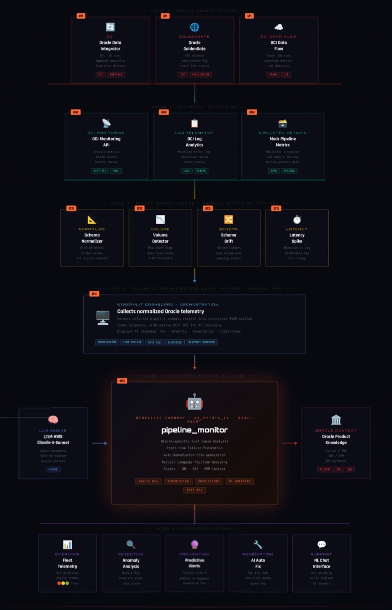

# Architecture Diagram

Primary diagram asset:
- `docs/archdiag.jpeg`

## Overview
The solution is designed as an Oracle telemetry control tower. Operational metrics are collected from Oracle integration services such as Oracle Data Integrator, Oracle GoldenGate, and OCI Data Flow, along with OCI Monitoring and log-based signals. These metrics are normalized into a common pipeline model inside the monitoring platform, where health scoring, anomaly prioritization, predictive risk analysis, and BlueVerse-assisted remediation are performed.

## Oracle Telemetry Inputs
The platform is intended to ingest pipeline signals such as:
- pipeline status
- expected versus actual rows processed
- job duration and latency
- GoldenGate lag and replication delay
- failed-run indicators and error signals
- schema drift notes or type mismatches
- last successful run timestamp

## Integration Flow
1. Oracle source systems and enterprise applications generate business data and operational events.
2. Oracle integration services such as Oracle Data Integrator, Oracle GoldenGate, and OCI Data Flow move, transform, or replicate that data across Oracle targets.
3. OCI Monitoring APIs, execution logs, and service-specific telemetry expose runtime signals such as lag, throughput, duration, failures, and schema-impact events.
4. The monitoring platform maps those metrics into a unified Oracle pipeline schema.
5. Analytics functions compute health score, anomaly intensity, and predictive failure risk.
6. Selected pipeline context is sent to BlueVerse with Oracle-specific prompts and supplemental Oracle knowledge context.
7. The control tower presents fleet telemetry, anomaly insights, predictive alerts, remediation guidance, and support-chat responses to the operator.

## Platform Responsibilities
- `data_sources.py` models Oracle pipeline telemetry and defines the future hook for OCI Monitoring integration.
- `app.py` acts as the OCI control tower UI and workflow orchestration layer.
- `analytics.py` computes health score and predictive risk ranking.
- `blueverse.py` sends structured Oracle telemetry context to BlueVerse, injects Oracle-reference grounding, and handles fallback safeguards.
- `config.py` manages BlueVerse configuration without blocking the dashboard when AI secrets are unavailable.

## Context Management And Caching
- mock telemetry is cached with `st.cache_data(ttl=300)` in `data_sources.py`
- remediation requests use selected-pipeline context rather than the full fleet
- support chat uses the fleet telemetry snapshot plus recent chat history as grounding context
- `st.session_state.messages` preserves basic multi-turn conversation history within the active Streamlit session

## Current Prototype Scope
The current prototype uses normalized Oracle-shaped telemetry and mock Oracle pipeline metrics to demonstrate the end-to-end operating model. The architecture is intentionally aligned to future live ingestion from OCI Monitoring APIs, Oracle service logs, and execution telemetry without changing the control-tower workflow.
